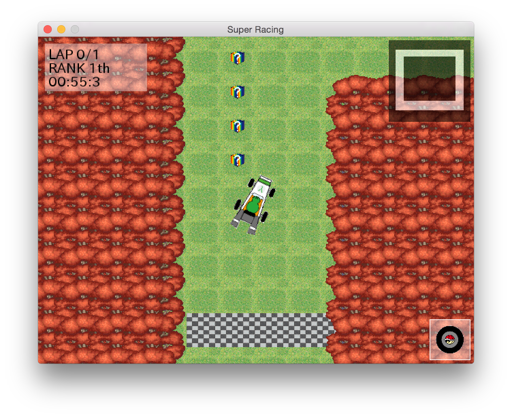
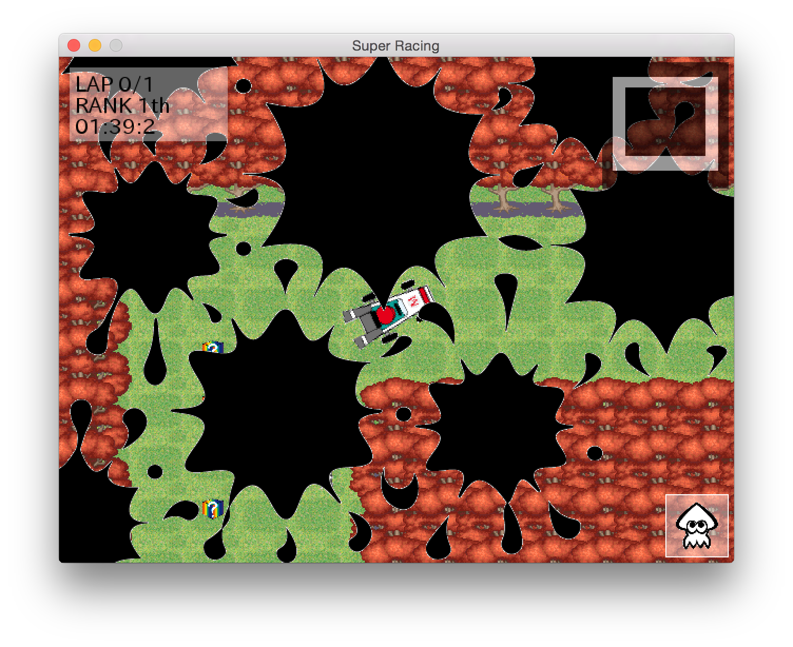

# SuperCarRacing11

演習のグループワークで作成したレースゲーム

動作環境
	MacOS 10.9.5
	gcc 4.9.0

使用ライブラリ（同梱）
	SDL2.0.3
	SDL_image 2.0
	SDL_ttf 2.0
	これらはzlib lisenceで配布されている。

コンパイル方法
	sourcesフォルダに移動して
	$ make
	MacアプリSuperRacing11.app、SuperRacing11_Server.appがsources下に生成される
	このファイルはどのフォルダに移動させても実行できる
	また、
	$ make develop
	を実行するとsourcesフォルダ下に実行ファイルserver.out,client.outが生成される
	このファイルは別のフォルダに移動させると正常に実行できない

起動方法
	MacアプリSuperRacing11.app、SuperRacing11_Server.appはFinderでダブルクリック、または
	$ open SuperRacing11.app
	$ open SuperRacing11_Server.app
	で起動できる
	実行ファイルserver.out,client.outは
	$ ./server.out
	$ ./client.out
	で起動できる

使い方
	まずサーバーを立ち上げておく。
	次にクライアントを立ち上げ、画面指示に従ってハンドル名、サーバーのIPを入力する。
	プレーヤが４人集まったらキャラ選択画面になるので選択する(Enter)
	全員が選択したらゲームが始まる。コースはランダムに決まる。
	ゲームはZで前進、Xで後退、A or Cでアイテム使用、アローキー左右で方向転換する
	qを押すことで途中終了できるが、その場合ゲームに関わる全てのアプリが連動して終了する。
